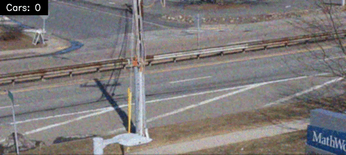

# Traffic Flow Monitoring Using Image Segmentation



The project implements a vehicle detection pipeline using classical image processing techniques. It was developed as the final project for the **Image Processing for Engineering and Science** specialization from **Mathworks** and demonstrates that robust computer vision doesn't always require resource-heavy deep learning.

## Methodology

The algorithm uses **background subtraction**, which is a "cheap" and optimized approach.

The Pipeline:

- **Preprocessing:** Filters the input frame in order to reduce noise.
- **Background Computation:** Generates a static background by averaging all the video frames. In a real-world environment, updating the background at a fixed rate allows you to handle illumination changes.

- **Car segmentation:** Extracts moving objects via absolute difference and thresholding.

- **Morphological Cleaning:** Uses closing to improve the generated mask image.

- **Contour Analysis:** Identifies valid objects and draws bounding boxes based on area constraints.

## Prerequisites

- Docker (_recommended for GUI and environment consistency_)
- X11 Server (_for Linux/Ubuntu GUI display_)

## Getting started

To run this project on an Ubuntu 22.04 environment:

```bash
# Clone the repository
git clone https://github.com/GGSVic/Traffic-Flow-Monitoring-Using-Image-Segmentation.git
# Build the docker image
docker build -t traffic-flow .
# Add permission for docker applications to display their graphical user interfaces
xhost +local:docker
# Run the container with the mounted volumes and the needed configuration to display GUIs
docker run -e DISPLAY=$DISPLAY -v "(pwd):/app" -v /tmp/.X11-unix:/tmp/.X11-unix traffic-flow:latest
```
